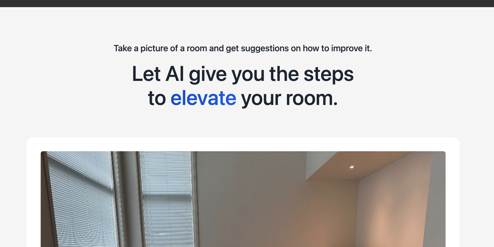

# Improve My Room AI



## How it works

This app is powered by:

🚀 [Replicate](https://replicate.com/?utm_source=project&utm_campaign=improve-my-room-ai), a platform for running machine learning models in the cloud.

🖍️ [Llava 13B](https://replicate.com/yorickvp/llava-13b?utm_source=project&utm_campaign=improve-my-room-ai), an open-source visual instruction model tuning towards large language and vision models with GPT-4 level capabilities.

▲ [Vercel](https://vercel.com/), a platform for running web apps.

⚡️ Nuxt.js [server-side API routes](server/api), for talking to Replicate's API.

👀 Nuxt.js Vue components, for the browser UI.

## Development

1. Install a recent version of [Node.js](https://nodejs.org/)
1. Copy your [Replicate API token](https://replicate.com/account?utm_source=project&utm_campaign=improve-my-room-ai) and set it in your environment:
   ```
   echo "REPLICATE_API_TOKEN=<your-token-here>" > .env.local
   ```
1. Install dependencies and run the server:
   ```
   npm install
   npm run dev
   ```
1. Open [localhost:3000](http://localhost:3000) in your browser. That's it!
